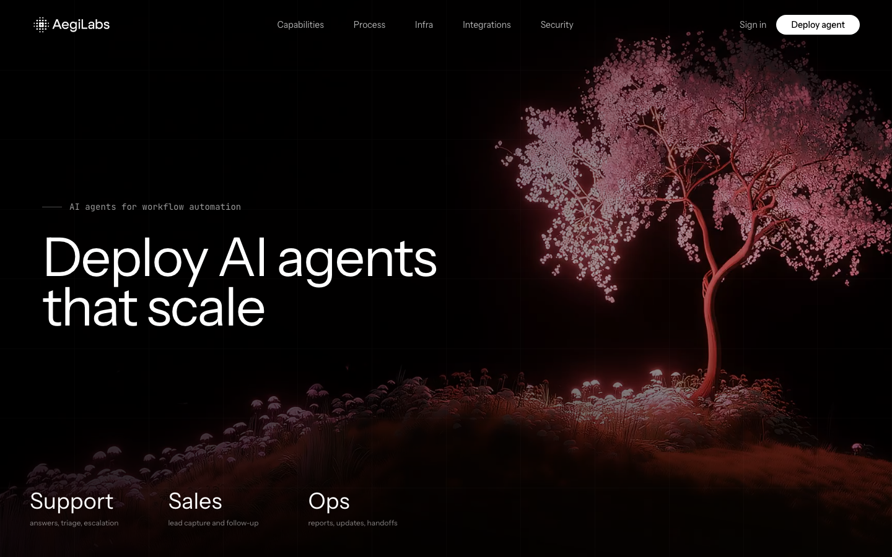

<div align="center">


# AegiLabs

**AI agents for workflow automation — designed, deployed, and monitored for support, sales, reporting, and internal ops.**

[**Live site → aegilabs-website.vercel.app**](https://aegilabs-website.vercel.app)


<br />



</div>

## What it is

AegiLabs is a full product site + app for an AI-agent automation platform. Visitors land on an animated marketing page; signed-up users configure their own AI agent through an onboarding flow, then manage it from a dashboard and talk to it in a live chat sandbox powered by Groq.

The landing page leans into a distinctive dark aesthetic: a glowing cherry-blossom hero scene, a custom **ASCII 3D renderer** written from scratch on a `<canvas>` (no library — just math and a ` .:-=+*#%@` character ramp), typographic sections set in Instrument Sans/Serif and JetBrains Mono, and shadcn/ui components throughout.

## Features

- **Marketing site** — hero, capabilities, process, infrastructure, live metrics, ASCII showcase, integrations, security, developer docs teaser, pricing, and CTA sections, composed as isolated React components
- **Authentication** — Clerk with SSO callback flow; the whole app degrades gracefully and still runs if Clerk keys are absent (middleware and layout both check before wiring auth)
- **Onboarding** — first-run form that captures agent name, use case, connected tools, model preference, and autonomy level, persisted via server actions
- **Dashboard** — agent status and configuration overview for the signed-in user
- **Chat sandbox** — `/dashboard/agent` streams responses from **Llama 3.3 70B on Groq** through the Vercel AI SDK; the system prompt is built dynamically from the user's saved agent config (role, tools, autonomy level), so each user chats with *their* agent
- **Database** — Supabase Postgres with row-level security: `profiles`, `agent_configs`, `demo_requests`, `chat_messages`

## Tech stack

| Layer | Choice |
|---|---|
| Framework | Next.js 16 (App Router) + React 19 + TypeScript |
| Styling | Tailwind CSS v4, shadcn/ui (Radix primitives), tw-animate-css |
| Auth | Clerk (`@clerk/nextjs`) with protected routes via middleware |
| Data | Supabase (Postgres + RLS) |
| AI | Vercel AI SDK + `@ai-sdk/groq` (`llama-3.3-70b-versatile`), streaming |
| 3D / visuals | react-three-fiber + three.js, custom canvas ASCII renderer |
| Fonts | Instrument Sans, Instrument Serif, JetBrains Mono |
| Hosting | Vercel + Vercel Analytics |

## Project structure

```
app/
  page.tsx              # Landing page (section composition)
  layout.tsx            # Fonts, Clerk provider, analytics
  api/chat/route.ts     # Streaming Groq chat, config-driven system prompt
  onboarding/           # First agent setup (form + server actions)
  dashboard/            # Agent status, config, chat sandbox
  sso-callback/         # Clerk SSO handshake
  auth-redirect/        # Post-auth routing (onboarding vs dashboard)
components/
  landing/              # 15 landing sections incl. ascii-scene.tsx
  ui/                   # shadcn/ui component library
supabase/
  schema.sql            # Tables + RLS policies
proxy.ts                # Clerk middleware protecting /onboarding, /dashboard
```

## Running locally

```bash
pnpm install
cp .env.example .env.local   # then fill in the keys below
pnpm dev
```

Set up services (full walkthrough in [AUTH_SETUP.md](AUTH_SETUP.md)):

1. Create a **Clerk** project and copy both keys.
2. Create a **Supabase** project and run `supabase/schema.sql` in the SQL editor.
3. Add a **Groq** API key for the chat sandbox.

| Variable | Purpose |
|---|---|
| `NEXT_PUBLIC_CLERK_PUBLISHABLE_KEY` / `CLERK_SECRET_KEY` | Clerk auth |
| `NEXT_PUBLIC_SUPABASE_URL` / `NEXT_PUBLIC_SUPABASE_ANON_KEY` | Supabase client |
| `SUPABASE_SERVICE_ROLE_KEY` | Server-side Supabase access |
| `GROQ_API_KEY` | Chat sandbox model (Groq) |

Without Clerk keys the marketing site still runs — auth-gated routes are simply skipped.

## Deployment

Deployed on **Vercel**. Add the same environment variables in Project Settings, push to `main`, and Vercel builds automatically.

---

<div align="center">
Built by <a href="https://github.com/Arxsher">Arxsher</a> · <a href="https://arsher.is-a.dev">arsher.is-a.dev</a>
</div>
